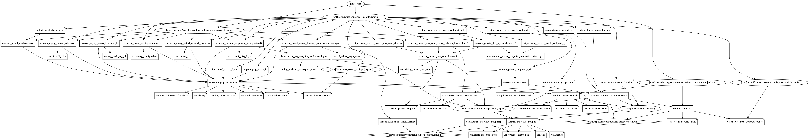

# Azure Database for MySQL Terraform Module

Azure Database for MySQL is easy to set up, manage and scale. It automates the management and maintenance of your infrastructure and database server, including routine updates, backups and security. Enjoy maximum control of database management with custom maintenance windows and multiple configuration parameters for fine grained tuning with Flexible Server (Preview).

## Resources are supported

* [MySQL Servers](https://registry.terraform.io/providers/hashicorp/azurerm/latest/docs/resources/mysql_server)
* [MySQL Database](https://registry.terraform.io/providers/hashicorp/azurerm/latest/docs/resources/mysql_database)
* [MySQL Configuration](https://registry.terraform.io/providers/hashicorp/azurerm/latest/docs/resources/mysql_configuration)
* [MySQL Firewall Rules](https://registry.terraform.io/providers/hashicorp/azurerm/latest/docs/resources/mysql_firewall_rule)
* [MySQL Active Directory Administrator](https://registry.terraform.io/providers/hashicorp/azurerm/latest/docs/resources/mysql_active_directory_administrator)
* [MySQL Customer Managed Key](https://registry.terraform.io/providers/hashicorp/azurerm/latest/docs/resources/mysql_server_key)
* [MySQL Virtual Network Rule](https://registry.terraform.io/providers/hashicorp/azurerm/latest/docs/resources/mysql_virtual_network_rule)
* [MySQL Diagnostics](https://docs.microsoft.com/en-us/azure/azure-sql/database/metrics-diagnostic-telemetry-logging-streaming-export-configure?tabs=azure-portal)

## Module Usage

```hcl
module "mssql-server" {
  source  = "kumarvna/mysql-db/azurerm"
  version = "1.0.0"

  # By default, this module will create a resource group
  # proivde a name to use an existing resource group and set the argument 
  # to `create_resource_group = false` if you want to existing resoruce group. 
  # If you use existing resrouce group location will be the same as existing RG.
  create_resource_group = false
  resource_group_name   = "rg-shared-westeurope-01"
  location              = "westeurope"

  # MySQL Server and Database settings
  mysqlserver_name = "roshmysqldbsrv01"

  mysqlserver_settings = {
    sku_name   = "GP_Gen5_16"
    storage_mb = 5120
    version    = "5.7"
    # Database name, charset and collection arguments  
    database_name = "roshydemomysqldb"
    charset       = "utf8"
    collation     = "utf8_unicode_ci"
    # Storage Profile and other optional arguments
    auto_grow_enabled                 = true
    backup_retention_days             = 7
    geo_redundant_backup_enabled      = false
    infrastructure_encryption_enabled = false
    public_network_access_enabled     = true
    ssl_enforcement_enabled           = true
    ssl_minimal_tls_version_enforced  = "TLS1_2"
  }

  # MySQL Server Parameters
  # For more information: https://docs.microsoft.com/en-us/azure/mysql/concepts-server-parameters
  mysql_configuration = {
    interactive_timeout = "600"
  }

  # Use Virtual Network service endpoints and rules for Azure Database for MySQL
  subnet_id = var.subnet_id

  # The URL to a Key Vault custom managed key
  key_vault_key_id = var.key_vault_key_id

  # To enable Azure Defender for database set `enable_threat_detection_policy` to true 
  enable_threat_detection_policy = true
  log_retention_days             = 30
  email_addresses_for_alerts     = ["user@example.com", "firstname.lastname@example.com"]

  # AD administrator for an Azure SQL server
  # Allows you to set a user or group as the AD administrator for an Azure SQL server
  ad_admin_login_name = "firstname.lastname@example.com"


  # (Optional) To enable Azure Monitoring for Azure MySQL database
  # (Optional) Specify `storage_account_name` to save monitoring logs to storage. 
  log_analytics_workspace_name = "loganalytics-we-sharedtest2"

  # Firewall Rules to allow azure and external clients and specific Ip address/ranges. 

  firewall_rules = {
    access-to-azure = {
      start_ip_address = "0.0.0.0"
      end_ip_address   = "0.0.0.0"
    },
    desktop-ip = {
      start_ip_address = "49.204.228.223"
      end_ip_address   = "49.204.228.223"
    }
  }

  # Tags for Azure Resources
  tags = {
    Terraform   = "true"
    Environment = "dev"
    Owner       = "test-user"
  }
}
```

## Advanced Usage of the Module

### `mysql_setttings` - Setting up your MySQL Server

This object helps you setup desired MySQL server and support following arguments.

| Argument | Description |
|--|--|
`sku_name`|Specifies the SKU Name for this MySQL Server. The name of the SKU, follows the tier + family + cores pattern (e.g. `B_Gen4_1`, `GP_Gen5_8`). Valid values are `B_Gen4_1`, `B_Gen4_2`, `B_Gen5_1`, `B_Gen5_2`, `GP_Gen4_2`, `GP_Gen4_4`, `GP_Gen4_8`, `GP_Gen4_16`, `GP_Gen4_32`, `GP_Gen5_2`, `GP_Gen5_4`, `GP_Gen5_8`, `GP_Gen5_16`, `GP_Gen5_32`, `GP_Gen5_64`, `MO_Gen5_2`, `MO_Gen5_4`, `MO_Gen5_8`, `MO_Gen5_16`, `MO_Gen5_32`.
`storage_mb`|Max storage allowed for a server. Possible values are between `5120` MB(5GB) and `1048576` MB(1TB) for the Basic SKU and between `5120` MB(5GB) and `4194304` MB(4TB) for General Purpose/Memory Optimized SKUs.
`version`|Specifies the version of MySQL to use. Valid values are `5.6`, `5.7`, and `8.0`. 
`database_name`|Specifies the name of the MySQL Database, which needs [to be a valid MySQL identifier](https://dev.mysql.com/doc/refman/5.7/en/identifiers.html). 
`charset`|Specifies the Charset for the MySQL Database, which needs [to be a valid MySQL Charset](https://dev.mysql.com/doc/refman/5.7/en/charset-charsets.html). 
`collation`|Specifies the Collation for the MySQL Database, which needs [to be a valid MySQL Collation](https://dev.mysql.com/doc/refman/5.7/en/charset-mysql.html).
`administrator_login`|The Administrator Login for the MySQL Server. Required when `create_mode` is `Default`.
`auto_grow_enabled`|Enable/Disable auto-growing of the storage. Storage auto-grow prevents your server from running out of storage and becoming read-only. If storage auto grow is enabled, the storage automatically grows without impacting the workload. The default value if not explicitly specified is `true`
`backup_retention_days`|Backup retention days for the server, supported values are between `7` and `35` days.
`geo_redundant_backup_enabled`|urn Geo-redundant server backups on/off. This allows you to choose between locally redundant or geo-redundant backup storage in the General Purpose and Memory Optimized tiers. When the backups are stored in geo-redundant backup storage, they are not only stored within the region in which your server is hosted, but are also replicated to a paired data center. This provides better protection and ability to restore your server in a different region in the event of a disaster. This is not supported for the `Basic` tier.
`infrastructure_encryption_enabled`|Whether or not infrastructure is encrypted for this server. Defaults to `false`
`public_network_access_enabled`|Whether or not public network access is allowed for this server. Defaults to `true`.
`ssl_enforcement_enabled`|Specifies if SSL should be enforced on connections. Possible values are `true` and `false`
`ssl_minimal_tls_version_enforced`|The minimum TLS version to support on the sever. Possible values are `TLSEnforcementDisabled`, `TLS1_0`, `TLS1_1`, and `TLS1_2`. Defaults to `TLSEnforcementDisabled`.

### `mysql_configuration` - Configure MySQl Server Parameters

The MySQL server maintains many system variables that configure its operation. Each system variable has a default value. System variables can be set at server startup using options on the command line or in an option file. Most of them can be changed dynamically at runtime using the SET statement, which enables you to modify operation of the server without having to stop and restart it. You can also use system variable values in expressions.

A few Supported parameters are here for your reference. you can find all these `Server Paramter` section in MySQL server. Also check [MySQL website](https://dev.mysql.com/doc/refman/8.0/en/server-options.html) for more details. 

| Parameter name | Description | Parameter Type |Default Value
|--|--|--|--|
`audit_log_enabled`|Allow to audit the log. Valid options are `ON` or `OFF`|Dynamic|`OFF`
`connect_timeout`|The number of seconds that the mysqld server waits for a connect packet before responding with Bad handshake|Dynamic|`10`
`innodb_buffer_pool_size`|The size in bytes of the buffer pool, the memory area where InnoDB caches table and index data.Allowed value should be: `134217728`-`65498251264` |Static|`65498251264`
`interactive_timeout`|Number of seconds the server waits for activity on an interactive connection before closing it. Allowed value should be: `1`-`31536000`|Dynamic|`600`
`lock_wait_timeout`|This variable specifies the timeout in seconds for attempts to acquire metadata locks. Allowed value should be: `1`-`31536000`|Dynamic|`31536000`
`max_connections`|The maximum permitted number of simultaneous client connections. Allowed value should be: `10`-`5000`|Dynamic|`2500`
`time_zone`|The server time zone.|Dynamic|`SYSTEM`

### Virtual Network service endpoints and rules

Virtual network rules are one firewall security feature that controls whether your Azure Database for MySQL server accepts communications that are sent from particular subnets in virtual networks.


## Requirements

| Name      | Version   |
| --------- | --------- |
| terraform | >= 0.13   |
| azurerm   | >= 2.59.0 |

## Providers

| Name    | Version   |
| ------- | --------- |
| azurerm | >= 2.59.0 |

## Inputs

| Name | Description | Type | Default |
|--|--|--|--|
`create_resource_group` | Whether to create resource group and use it for all networking resources | string | `"false"`
`resource_group_name` | The name of the resource group in which resources are created | string | `""`
`location` | The location of the resource group in which resources are created | string | `""`
`log_analytics_workspace_name`|The name of log analytics workspace name|string|`null`
`random_password_length`|The desired length of random password created by this module|string|`24`
`subnet_id`|The resource ID of the subnet|string|`null`
`mysqlserver_name`|MySQL server Name|string|`""`
`admin_username`|The username of the local administrator used for the SQL Server|string|`"sqladmin"`
`admin_password`|The Password which should be used for the local-administrator on this SQL Server|string|`null`
`identity`|If you want your SQL Server to have an managed identity. Defaults to false|string|`false`
`mysqlserver_settings`|MySQL server settings|object({})|`{}`
`storage_account_name`|The name of the storage account name|string|`null`
`enable_threat_detection_policy`|Threat detection policy configuration, known in the API as Server Security Alerts Policy|string|`false`
`email_addresses_for_alerts`|Account administrators email for alerts|`list(any)`|`""`
`disabled_alerts`|Specifies an array of alerts that are disabled. Allowed values are: `Sql_Injection`, `Sql_Injection_Vulnerability`, `Access_Anomaly`, `Data_Exfiltration`, `Unsafe_Action`|list(any)|`[]`
`log_retention_days`|Specifies the number of days to keep in the Threat Detection audit logs|number|`30`
`mysql_configuration`|Sets a MySQL Configuration value on a MySQL Server|map(string)|`{}`
firewall_rules|Range of IP addresses to allow firewall connections|map(object({}))|`null`
`ad_admin_login_name`|The login name of the principal to set as the server administrator|string|`null`
`key_vault_key_id`|The URL to a Key Vault custom managed key|string|`null`
`extaudit_diag_logs`|Database Monitoring Category details for Azure Diagnostic setting|list(string)|`["MySqlSlowLogs", "MySqlAuditLogs"]`
`Tags` | A map of tags to add to all resources | map | `{}`

## Outputs

| Name | Description |
|--|--|
`mysql_server_id`|The resource ID of the MySQL Server
`mysql_server_fqdn`|The FQDN of the MySQL Server
`mysql_database_id`|The resource ID of the MySQL Database

## Resource Graph



## Authors

Originally created by [Kumaraswamy Vithanala](mailto:kumarvna@gmail.com)

## Other resources

* [Azure database for MySQL](https://docs.microsoft.com/en-us/azure/mysql/)
* [Terraform AzureRM Provider Documentation](https://www.terraform.io/docs/providers/azurerm/index.html)
